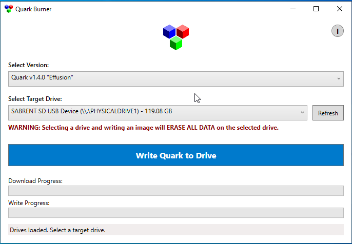

# SD card installation

=== "Manual"

    **Formatting**

    To install Quark, you'll need a microSD card formatted to the FAT32 file system:

    !!! tip
        If your microSD card is 32GB or below in capacity, it should already be formatted to FAT32 from the factory. This step can be skipped if this is the case.

    === "Windows"

        1. Install and launch [Rufus](https://rufus.ie)
        2. Insert your microSD card into your computer (via a built-in slot or USB reader)
        3. Select it within Rufus under *Device*
        4. Under *Boot Selection*, select `Non bootable`
        5. Under File system, select `FAT32 (Default)` or `Large FAT32 (Default)` depending on the size of your microSD card 
        6. Click `START` and confirm that you wish to wipe and format your device

    === "macOS"

        1. Insert your SD card into your computer (via a built-in slot or USB reader)
        2. Launch Disk Utility (*Applications > Utilities > Disk Utility*)
        3. Select the drive you want to format and click *Erase*
        4. For the format, choose `MS-DOS (FAT)` and choose `Master Boot Record` for the scheme and click *Erase*
    
        Alternatively, the command line can be used for formatting:

        ```sh
        # use `diskutil list` to find which disk corresponds to your microSD card
        ~ % sudo diskutil eraseDisk FAT32 MBRFormat /dev/diskN
        ```

    === "Linux"

        1. Insert your SD card into your computer (via a built-in slot or USB reader)
        2. Open a terminal and run the following commands as root (or via sudo)

        ```sh
        $ sudo umount /dev/sdX1 # Use `lsblk` to find which device corresponds to your microSD card.
        $ sudo mkfs.vfat -F 32 /dev/sdX1 # This assumes the microSD card has a single partition
        ```

    **Installation**

    The hard part is now over. With the latest release of Quark downloaded, open it in your favourite archive browser (i.e. 7-Zip) and extract it over the root of your newly formatted microSD card.

    Congratulations! You have now installed Quark on your TrimUI Smart!

=== "One-Click Installer"

    {align=right}

    **Quark Burner**

    !!! note
        This method is only available for Windows users as of current.

    Windows users can alternatively download the program below for installing Quark:

    [Download Quark Burner](../../assets/files/QuarkBurner.exe){ .md-button }

    Just select the version of Quark you'd like to install and the SD card you'd like to install it on and then hit the blue *Write Quark to Drive* button. 
    
    The program will then download and verify the latest version of Quark, format your SD card and unzip it for you!

**First Boot**

After the installation process is complete, insert your card into your Smart and boot. The first boot procedure may take some time depending on if you've already pre-populated your card with ROMs (see [here](../roms.md) for details on how to add ROMs)