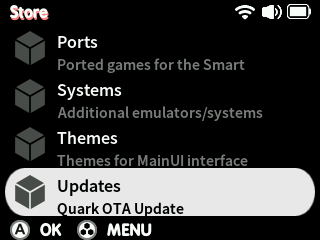
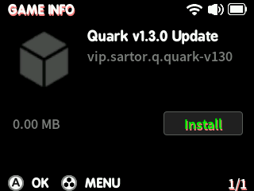
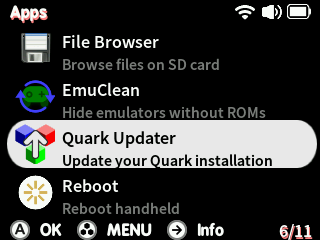

# Updating Quark

!!! warning
    Before updating, always make sure to create save files in-game (**not save states**) for your games - updates to RetroArch cores may cause save state incompatibilities!

=== "OTA (Recommended)"

    !!! note
        This method requires Quark v1.1.0 or newer

    1. With your Smart connected to WiFi, navigate to the Store from the main menu. You may need to refresh, in this case press MENU then select *Refresh*.
    2. Head to Updates and then select the latest update package
    
        

    3. Select the latest update package, then select *INSTALL*

        

    4. Reboot your device, or perform an action that restarts MainUI (i.e. launch or exit a game or app)
    5. Head to Apps, then select the *Quark Updater*

        

    Your Smart will then extract the update package onto your SD card, then reboot. Your data (i.e. saves and configs) will be preserved across the update.

=== "Updater Package"

    !!! note
        This method works with all versions of Quark

    1. Download the Updater package from the latest release of Quark [here](https://github.com/cobaltgit/Quark/releases/latest) (i.e. `Quark-v1.5.0-Updater.zip`)
    2. Extract the package to the root of your microSD card, insert and boot your Smart.
    3. Head to Apps, then select the *Quark Updater*

        

    Your Smart will then extract the update package onto your SD card, then reboot. Your data (i.e. saves and configs) will be preserved across the update.

=== "Fresh Install"

    Make sure you have everything you need backed up from your previous install. Delete everything on your microSD card (except BIOS, ROMs, saves and other user-made changes) and extract the release into the root as if you're installing fresh.