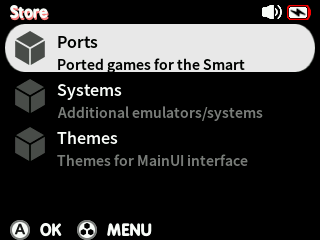

# Quark Gluons

So you might ask, what are *gluons*? They are add-ons that can be installed alongside the Quark base system.

Gluons are, in essence, zip archives that have the same folder structure as your Quark installation so that they can extract into your system and integrate as smoothly as possible.

For example, below is the directory tree for the FinalBurn Neo system gluon - gluons adding additional systems via RetroArch i.e. ScummVM will have a similar structure:

```
Quark_System_FBNeo.zip
└── mnt
    └── SDCARD
        ├── Emus
        │   ├── .emu_setup
        │   │   └── opts
        │   │       └── FBNEO.opt
        │   └── FBNEO
        │       ├── config.json
        │       └── ic-FBNEO.png
        ├── RetroArch
        │   └── .retroarch
        │       ├── core_info
        │       │   └── fbneo_libretro.info
        │       └── cores
        │           └── fbneo_libretro.so
        └── Roms
            └── FBNEO
                └── Imgs
```

This makes packaging your own gluons for the Quark system easy!

The official [Quark Gluons](https://github.com/cobaltgit/Quark-Gluons) repository includes gluons for:

* Additional game systems that are too large to be included in the Quark base system
* Themes for MainUI
* Ported games for the Smart

!!! note
    Some ports may require additional data files. Please consult the `readme.txt` file in the port gluon's data folder (`SDCARD:/Roms/PORTS/.data/<port>`)

## Installing gluons

To install a gluon, download it from the [releases](https://github.com/cobaltgit/Quark-Gluons/releases) section of the Quark Gluons repository and place it into `SDCARD:/System/archives`. (**Do not extract the archive into the directory**)

Insert the SD card into your Smart and boot - it may take a little longer, this will be the archive automatically unpacking into your system.

!!! warning
    We are not responsible for anything that may occur to your system as a result of installing Gluons from sources outside of the official repository.

### App store

!!! note
    This feature requires Quark v1.1.0 or newer



Official gluons can alternatively be installed via the built-in app store. Make sure your Smart is connected to WiFi and select the *Store* option from the main menu. To refresh the store, press MENU and select *Refresh*, or reboot your device.