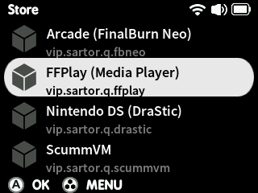

# Media Player

Aside from Quark's rudimentary built-in MP3 player, a gluon is also available containing `ffplay`, the recommended choice for playing a range of videos and music on your Smart.

This gluon is available from the Quark Store, under *Systems*, or can be downloaded from the corresponding release on GitHub [here](https://github.com/cobaltgit/Quark-Gluons/releases/tag/systems)
{align=right}

After installation, drop your media into `SDCARD:/Roms/MEDIA`

!!! tip
    Click the button below to download a Handbrake preset with recommended settings for encoding videos for the Smart:

    This encodes video to 320x240 maximum resolution, using H.264 codec with AAC mono downmixed audio. If you have a build of Handbrake with FDK-AAC enabled, consider switching the audio codec to **AAC (FDK)** for slightly better audio quality.

    You may also want to increase the audio track's gain depending on the input media to compensate for the Smart's small speaker.

    [Download Handbrake preset](../../assets/files/Handbrake-TrimUI-Smart.json){ .md-button }

## Controls

* **D-Pad Left/Right** - seek ±10 seconds
* **D-Pad Up/Down** - seek ±1 minute
* **MENU+L** - seek to next chapter marker if available, or +10 minutes
* **MENU+R** - seek to previous chapter marker if available, or -10 minutes
* **A** - toggle pause/play
* **MENU** - exit

## Compatibility

ffplay on the Smart is compatible with the following formats:

### Video

* `.mp4`
* `.mkv`
* `.avi`
* `.flv`
* `.m4v`
* `.mov`
* `.webm`
* `.ogv`
* `.mpg`
* `.wmv`

### Audio

!!! note
    Playing back audio will display a scrolling waveform visualisation

* `.mp3`
* `.mp2`
* `.m4a`
* `.mka`
* `.aac`
* `.ogg`
* `.oga`
* `.flac`
* `.wma`
* `.wav`