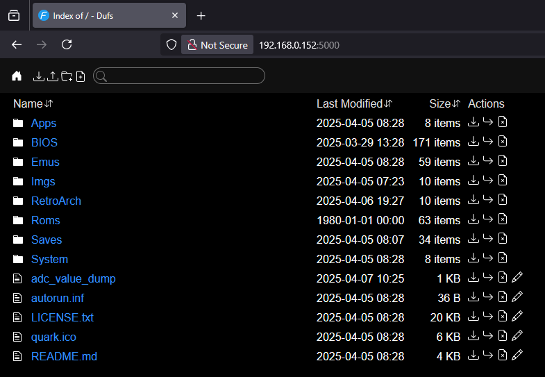

# Network services

Quark supports a variety of network services, available when WiFi is enabled and connected on your Smart:

## SSH

SSH access to your TrimUI Smart is easy, whilst also being useful for debugging!

* Default username: `root`
* Default password: `quark`

To enable and use SSH on your Smart:

1. Navigate to *Apps* from the main menu
2. Scroll down to *SSH Access* and press A.
3. The IP address and port should now show up as the app description. Using them, open a terminal and log in:

```sh
$ ssh root@<ip>
root@<ip>'s password: # password: quark
BusyBox v1.27.2 () built-in shell (ash)

/mnt/SDCARD # echo Hello SSH!
Hello SSH!
/mnt/SDCARD #
```

### SFTP

By extension, SFTP access is also supported, courtesy of [`gesftpserver`](https://www.greenend.org.uk/rjk/sftpserver/). Simply log in with your SSH credentials using your favourite SFTP client and transfer away!
```sh
$ sftp root@<ip>
root@<ip>'s password: # password: quark
sftp>
```

## Syncthing

A first for this device, support for Syncthing is included out of the box! This allows you to s ync your save files etc. with other devices!

* Default username: `quark`
* Default password: `quark`

To enable and use Syncthing on your Smart:

1. Navigate to *Apps* from the main menu
2. Scroll down to *Syncthing* and press A. It'll take a few seconds to generate the appropriate configuration at first...
3. The IP address and port should now show up as the app description. Open your favourite web browser and navigate to `http://<ip>:8384`
4. Log in with the default user and password listed above

!!! note
    Your Smart will appear to other devices on Syncthing as `Quark`

## HTTP file transfer (dufs)

Quark also supports transferring and editing files using a simple web UI thanks to [`dufs`](https://github.com/sigoden/dufs)!



* Default username: `quark`
* Default password: `quark`

To enable and use dufs on your Smart:

1. Navigate to *Apps* from the main menu
2. Scroll down to *WiFi File Transfer* and press A.
3. The IP address and port should now show up as the app description. Open your favourite web browser and navigate to `http://<ip>:5000`
4. Log in with the default user and password listed above
