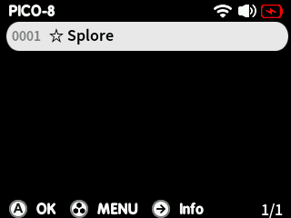
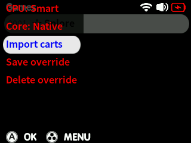

# PICO-8

{align=right}
Quark supports the Lexaloffle PICO-8 player, and has the ability to download and import carts via Splore!

Massive credit to sagotch for the [SDL2 build](https://github.com/sagotch/SDL2-TG2040) that makes this possible!

!!! note
    Native PICO-8 support requires Quark v1.6.0 or newer

To install PICO-8, purchase and download the binaries from the official website [here](https://www.lexaloffle.com/pico-8.php?#getpico8): more specifically, you will need the **Raspberry Pi** 32-bit version of PICO-8.
Download and extract the files `pico8.dat` and `pico8_dyn` from the PICO-8 zip file into the `BIOS/Pico-8` folder at the root of your Quark microSD card.
{align=right}

!!! tip
    If you previously purchased one of the following bundles, you already own a PICO-8 license:  
      - [Bundle for Racial Justice and Equality](https://itch.io/b/520/bundle-for-racial-justice-and-equality) (ended June 16th 2020)  
      - [PICO-8 Premium Bundle](https://itch.io/b/1104/pico-8-premium-bundle) (ended November 24th 2021)  

Navigate to the PICO-8 system within the Quark games menu and select `☆ Splore` to launch into Splore. You'll need an active WiFi connection to be able to download any carts from the PICO-8 BBS.

To exit Splore and return to MainUI, press the MENU button and then select `SHUTDOWN PICO-8`. To exit out of a cart, press START and then select either `SHUTDOWN` or `EXIT TO SPLORE`, depending on whether you launched from the MainUI gamelist or Splore respectively.

{align=right}

!!! warning
    Quark will fall back to the FAKE-08 RetroArch core if the appropriate PICO-8 binaries are not found, which means Splore will not work.
To import the carts you downloaded from the BBS via Splore into MainUI's game list, press X and select *Import carts*. You should now be able to launch your favourite PICO-8 carts directly from within the games list!

## FAKE-08

If you do not have the PICO-8 binaries, Quark includes the FAKE-08 RetroArch core, which to a degree can play some of the PICO-8 catalogue, **although some games are known to have audio issues.**

This can be selected via the core selector in the script list by pressing X, otherwise it will be used as a fallback if no PICO-8 binaries have been provided.

For the best experience, it's highly recommended to use the native PICO-8 player.
