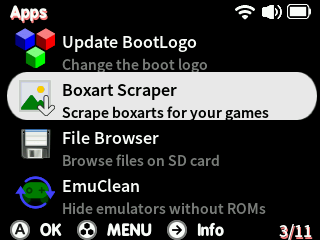

# Scraping Boxart

Quark v1.3.0 now has a built in boxart scraper! Just connect your Smart to WiFi, launch the *Boxart Scraper* app and let it rip! No accounts required, this scraper uses the [libretro thumbnails database](https://thumbnails.libretro.com)

 

!!! note
    Press SELECT+START to exit the scraper, you can continue from where you left off at any time.

    See the `SDCARD:/Apps/BoxartScraper/db` folder for compatible systems. 