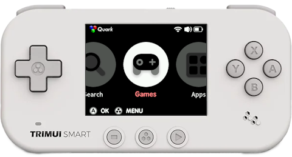

# Home

Quark is a modified version of the stock SD card package for the *TRIMUI Smart* handheld gaming device, originally created with the intention to trim (pun intended?) out the bloat from TRIMUI's official package as well as adding a multitude of extra goodies, such as additional systems, applications and ports.

[:simple-github: Download Quark](https://github.com/cobaltgit/Quark/releases/latest){ .md-button }
[:simple-discord: Join us!](https://discord.gg/2jU6yQ4ZT9){ .md-button }

!!! tip
	Want to test the very latest builds of Quark? Download our [nightly release](https://github.com/cobaltgit/Quark/releases/tag/nightly), based on the latest git commit!
	
	Do note these releases are **unstable** and may contain bugs intended to be fixed in stable releases!

## Why Quark?

Compared to the official stock base package, Quark:

* takes up less install space, much of the bloat has been removed
* includes many more supported game systems, from additional home consoles and handhelds to home computers and ported games.
* has the latest emulator cores and optimised CPU profiles for the best balance between performance, emulator features and battery life
* supports network services including Syncthing, SSH, SFTP and HTTP file transfer!

## Credits

* **[spruce](https://github.com/spruceUI) team:** centralised emulator launch, smart CPU governor logic and inspiration
* **[libretro](https://www.retroarch.com/):** icons from Systematic/Retroactive RetroArch XMB themes
* **Jutleys:** Dingux Commander from [Tomato](https://github.com/Jutleys/Trimui-Smart-Tomato), as well as some system icons
* **[chrizzo-hb](https://github.com/chrizzo-hb/knulli-bezels):** overlays/bezels for handheld systems

### Special thanks

* **[ryanmsartor](https://github.com/ryanmsartor)**: overall contributions, length-matching domain name for patched MainUI for Quark Store
* **[Marcoosio101](https://github.com/Marcoosio101)**: testing and issue reporting, default theme design
* **[spycat](https://github.com/spycat88)**: one-click installer for Windows
* **[sagotch](https://github.com/sagotch):** SDL2 build allowing native PICO-8 to run on the Smart!
